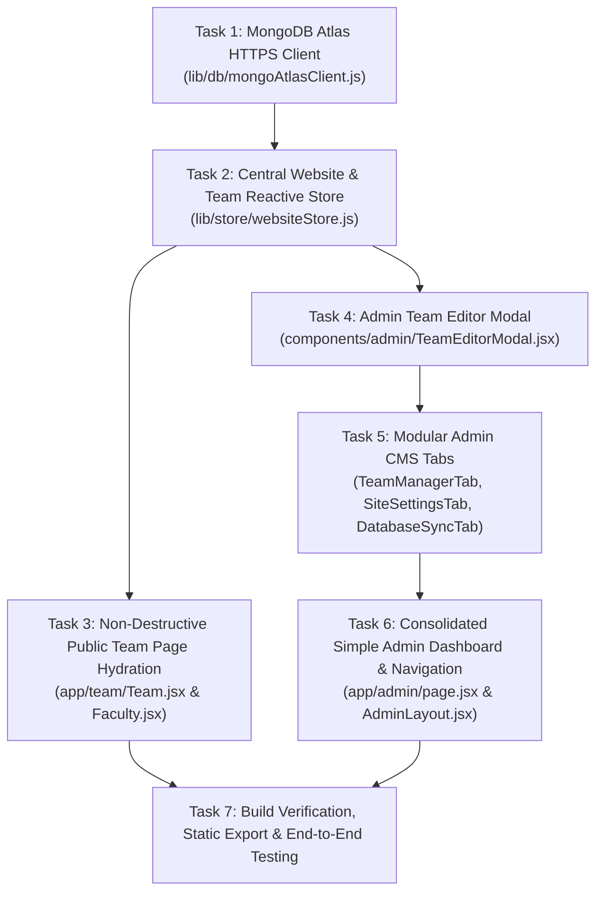

# Phase 2: Universal Admin Website Control, Live Team CMS, & MongoDB Atlas Data Gateway Implementation Plan

> **For agentic workers:** REQUIRED SUB-SKILL: Use superpowers:subagent-driven-development (recommended) or superpowers:executing-plans to implement this plan task-by-task. Steps use checkbox (`- [ ]`) syntax for tracking.

**Goal:** Transform the ROBORASHTRA Admin Terminal into a streamlined, intuitive Command Deck that can manage all website elements (Executive Leads, Faculty Mentors, Club Squad Crew, and Website Announcements/Status), while preparing the application for MongoDB Atlas using a resilient dual-mode architecture (Local Fallback + Atlas Data API) with zero regressions to the existing public pages and animations.

**Architecture:** Client-first reactive data architecture built on Next.js 14 App Router with static export (`output: 'export'`) on Cloudflare Pages. A new centralized `websiteStore` manages persistence via `localStorage` and reactive subscriptions, while an asynchronous `mongoAtlasClient` interacts with MongoDB Atlas via the Atlas Data API (HTTPS REST) using an API key and cluster endpoint. Public pages (`Team.jsx`, `Faculty.jsx`) maintain their static seed imports for instantaneous 0ms server/static generation and hydrate seamlessly on client mount.

**Design Language:** Tactical aerospace blueprint aesthetics (`.tick-frame`, deep blueprint `#0B132B`, glowing amber `#FF9F1C`, dark glass panels `#070B19`, Orbitron/JetBrains Mono typography). The layout remains clean, simple, and clutter-free.

---

## Global Constraints & Non-Negotiables
1. **Zero Visual Regressions**: `app/team/Team.jsx` (polar roulette wheel, rotation physics, mobile tabs) and `app/team/Faculty.jsx` (3D flippable cards, HUD corners) MUST retain their exact visual appearance, animations, and typography.
2. **Static Export Integrity**: `next build` with `output: 'export'` MUST continue to pass without errors. No Node.js runtime servers or unmocked dynamic route mismatches.
3. **Dual-Mode Graceful Fallback**: If no MongoDB Atlas API key is provided, the website MUST function 100% properly using local storage and default seeds. When the key is supplied, data syncs cleanly with Atlas.
4. **Complete Implementation**: No placeholders, no `TODO` or `TBD` comments. All CRUD forms and action handlers must be fully wired and functional.

---

## Plan Breakdown & Execution Waves



---

### Task 1: MongoDB Atlas HTTPS Data API Client
**Wave:** 1  
**Files to create:**
- `lib/db/mongoAtlasClient.js`

**Action:**
1. Implement a lightweight client for MongoDB Atlas Data API using native `fetch` (compatible with browsers, Cloudflare Pages, and Node environments).
2. Support configurable credentials:
   - `apiKey`: read from `process.env.NEXT_PUBLIC_MONGODB_ATLAS_API_KEY` or stored runtime setting.
   - `endpoint`: Atlas Data API endpoint URL (or app ID URL).
   - `cluster`: Atlas cluster name (default: `Cluster0`).
   - `database`: Atlas database name (default: `roborashtra`).
3. Implement core actions:
   - `ping()` / `testConnection()`: checks if the credentials and database are reachable.
   - `find(collection, filter, sort, limit)`
   - `findOne(collection, filter)`
   - `insertOne(collection, document)`
   - `updateOne(collection, filter, update, upsert)`
   - `deleteOne(collection, filter)`
4. Fallback behavior: if `apiKey` is empty or connection fails, fail gracefully with an explicit error object (`{ success: false, reason: 'NOT_CONFIGURED' | 'NETWORK_ERROR' }`) rather than crashing the application.

**Verify:** Run tests or console evaluation showing `mongoAtlasClient.testConnection()` returns `{ success: false, reason: 'NOT_CONFIGURED' }` when keys are omitted, without thrown exceptions.

---

### Task 2: Central Website & Team Reactive Store
**Wave:** 1  
**Files to create:**
- `lib/store/websiteStore.js`

**Action:**
1. Build a reactive state manager that unifies:
   - **Executive Leads** (`leads`): seeded from `teamData.leads`
   - **Faculty Mentors** (`faculty`): seeded from `data/faculty.js`
   - **Club Squads** (`squads`): seeded from `teamData.teams` (Workshop, PR, Event, PS, Design, Web, Content, Docs, CAD)
   - **Site Settings** (`siteSettings`): announcement banner message, registration status (`OPEN`, `CLOSED`, `WAITLIST`), live broadcast link, maintenance mode.
   - **Atlas Gateway Config**: stored API key, endpoint, auto-sync toggle, last synced timestamp.
2. Store key in `localStorage` under `roborashtra_website_cms_v1` with automatic fallback to initial seeds if empty.
3. Expose full CRUD methods:
   - `getLeads()`, `addLead(leadData)`, `updateLead(id, leadData)`, `deleteLead(id)`
   - `getFaculty()`, `addFaculty(facultyData)`, `updateFaculty(id, facultyData)`, `deleteFaculty(id)`
   - `getSquads()`, `getSquad(squadId)`, `addSquadMember(squadId, memberData, isHead)`, `updateSquadMember(squadId, memberId, memberData, isHead)`, `deleteSquadMember(squadId, memberId, isHead)`
   - `getSiteSettings()`, `updateSiteSettings(newSettings)`
   - `getAtlasConfig()`, `saveAtlasConfig(config)`
4. Implement sync engine:
   - `pushLocalToAtlas()`: sends all local leads, faculty, squads, and settings to their respective Atlas collections (`leads`, `faculty`, `squads`, `settings`).
   - `pullAtlasToLocal()`: fetches remote collections and updates local cache.
   - `resetToDefaults()`: safety button to restore factory static seed data.
5. Provide a Pub/Sub `subscribe(fn)` method so React components re-render automatically when data changes.

**Verify:** Execute unit verification in node or browser to confirm `getLeads()` returns initial seeds, `addLead()` adds a member and persists to localStorage, and subscribers receive notifications.

---

### Task 3: Public Team Page Non-Destructive Hydration
**Wave:** 2  
**Files to modify:**
- `app/team/Team.jsx`
- `app/team/Faculty.jsx`

**Action:**
1. **Preserve Initial Static State**: Keep `teamData` and `facultyMembers` imports as the default initial React state. This guarantees zero layout shift (CLS), instant rendering, and zero SSR/export mismatches during `next build`.
2. In `app/team/Team.jsx`:
   - Initialize state with `teamData.leads` and `teamData.teams`.
   - In `useEffect`, load live leads & squads from `websiteStore.getLeads()` and `websiteStore.getSquads()`.
   - Subscribe to `websiteStore.subscribe(...)` to listen for real-time updates from admin edits.
   - Ensure the roulette wheel polar calculations, mobile navigation tabs, and Cloudinary portrait delivery consume this reactive state without changing any styling or physics.
3. In `app/team/Faculty.jsx`:
   - Initialize state with `facultyMembers`.
   - In `useEffect`, load live faculty from `websiteStore.getFaculty()`.
   - Subscribe to `websiteStore.subscribe(...)`.
   - Ensure 3D card flipping, hover animations, corner HUD crosshairs, and credential tags work identically.

**Verify:** Check `/team` page rendering in browser; verify that adding or editing a member in the store immediately updates the UI without breaking any animation or styling.

---

### Task 4: Admin Team Editor Modal
**Wave:** 2  
**Files to create:**
- `components/admin/TeamEditorModal.jsx`

**Action:**
1. Create a modal supporting **Create** and **Edit** modes across all 3 team member types:
   - `EXECUTIVE_LEAD`: Name, Role, Cloudinary publicId / Image URL, Phone, Email, LinkedIn URL, GitHub URL, Instagram URL.
   - `FACULTY`: Name, Designation, Department, Badge (e.g. "FACULTY DIRECTOR"), Credentials (e.g. "Ph.D. Robotics"), Email, Bio/Description, Portrait URL.
   - `SQUAD_MEMBER`: Name, Role, Image URL (optional), Squad select (Workshop, PR, Event, PS, Design, Web, Content, Docs, CAD), Is Squad Lead toggle, LinkedIn URL, GitHub URL.
2. Built with the tactical blueprint styling: dark translucent backdrop, glowing border, clear uppercase input fields, validation warnings, and instant save/cancel actions.
3. Include helper for Cloudinary image URLs / public IDs with preview thumbnail.

**Verify:** Open modal, populate fields, submit, and confirm valid data structure is returned.

---

### Task 5: Modular Simple Admin CMS Tabs
**Wave:** 3  
**Files to create:**
- `components/admin/TeamManagerTab.jsx`
- `components/admin/SiteSettingsTab.jsx`
- `components/admin/DatabaseSyncTab.jsx`

**Action:**
1. **`TeamManagerTab.jsx`**:
   - Clean, simple visual interface with 3 sub-views:
     - **Executive Leads**: view cards showing photo, name, role, phone, email; "Add Lead" button; "Edit" and "Delete" on each card.
     - **Faculty Advisory**: view faculty cards showing portrait, credentials, badge, email; "Add Faculty", "Edit", "Delete".
     - **Club Squads**: tab selector for all 9 squads (Workshop, PR, Event, PS, Design, Web, Content, Docs, CAD); displays leads and members with count badges; "Add Member", "Edit", "Delete".
   - Search bar to quickly find any person by name or designation.
   - "Reset to Factory Seeds" emergency button with confirmation prompt.
2. **`SiteSettingsTab.jsx`**:
   - Quick website-wide control toggles:
     - **Registration Status**: Radio buttons for `OPEN`, `CLOSED`, `WAITLIST`.
     - **Site Announcement Banner**: Toggle on/off, input message (e.g. "Roborashtra 2027 registrations are now open on Unstop!"), accent color selector.
     - **Livestream Broadcast**: Toggle on/off, YouTube live URL.
     - Save button with immediate store persistence.
3. **`DatabaseSyncTab.jsx`**:
   - Connection status card: shows `CONNECTED TO ATLAS` (green) or `LOCAL STORAGE ONLY` (amber).
   - Configuration card:
     - MongoDB Atlas API Key input (masked with show/hide toggle).
     - MongoDB Atlas Data API Endpoint URL input.
     - Database name (`roborashtra`) and Cluster name (`Cluster0`).
     - "Test Connection" button with live status feedback.
   - Cloud Sync Controls:
     - **"Push Local Data to Atlas"**: one-click button to upload all current website data to MongoDB.
     - **"Pull Data from Atlas"**: one-click button to refresh local data from MongoDB.
     - Log console showing timestamped sync history and diagnostic messages.

**Verify:** Test tab switching, editing items, saving settings, and testing connection in each tab.

---

### Task 6: Consolidated Simple Admin Dashboard & Navigation
**Wave:** 3  
**Files to modify:**
- `app/admin/page.jsx`
- `components/admin/AdminLayout.jsx`
- `app/admin/teams/page.jsx`

**Action:**
1. In `app/admin/page.jsx`:
   - Replace complex scattered panels with a unified, clean, uncluttered tab bar:
     - `[OVERVIEW & TELEMETRY]`
     - `[TEAM & FACULTY CMS]`
     - `[SITE CONTROLS]`
     - `[MONGODB GATEWAY]`
     - `[DESK REGISTRATIONS]`
   - Keep the design simple, spacious, and easy to understand at a glance.
2. In `components/admin/AdminLayout.jsx`:
   - Keep the Master PIN (`2027`) security barrier.
   - Update quick-action top bar to give instant access to Team CMS, Scan QR, New Registration, and Lock Session.
3. In `app/admin/teams/page.jsx`:
   - Reuse the new `TeamManagerTab` component so navigating to `/admin/teams` directly renders the full team editing experience seamlessly.

**Verify:** Navigate across `/admin`, `/admin/teams`, and switch between all tabs cleanly without any lag or state desynchronization.

---

### Task 7: Build Verification, Static Export & End-to-End Testing
**Wave:** 4  
**Action:**
1. Run `npm run build` (`next build && node scripts/prune-out-images.mjs`) to verify that the static export compiles cleanly into `out/`.
2. Verify that there are zero TypeScript/JavaScript compilation errors or broken imports.
3. Test end-to-end user flow:
   - Enter `/admin` with PIN `2027`.
   - Edit an Executive Lead's role or name in the Team CMS.
   - Add a new crew member to the Workshop squad.
   - Navigate to `/team` and verify that the changes appear on the polar roulette wheel and squad details.
   - Check the MongoDB Gateway tab, verify connection diagnostics, and check the site settings tab.

**Verify:**
```bash
npm run build
```
Build succeeds with code 0.

---

## Acceptance Criteria
- [ ] Admin panel features full editing capabilities for Executive Leads, Faculty Mentors, and Club Squad Crew members.
- [ ] Public `/team` page updates dynamically when edits are made in the admin panel.
- [ ] Public `/team` page retains 100% of its existing animations, polar roulette wheel, 3D cards, and blueprint styling without visual regression.
- [ ] Admin panel includes website-wide controls for announcement ticker, registration status, and event banners.
- [ ] MongoDB Atlas Data API gateway client is implemented with dual-mode fallback (local storage works out of the box; syncs to Atlas when the API key is configured).
- [ ] `next build` static export succeeds with zero errors.
